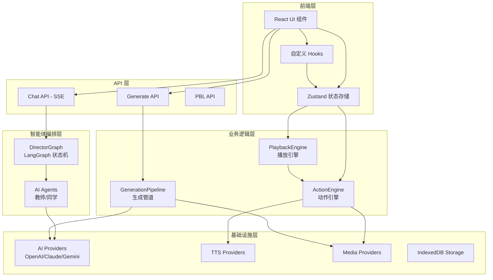
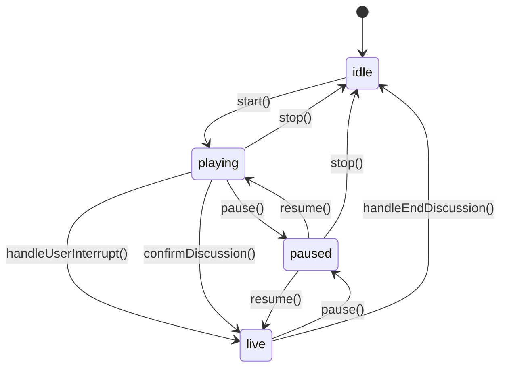
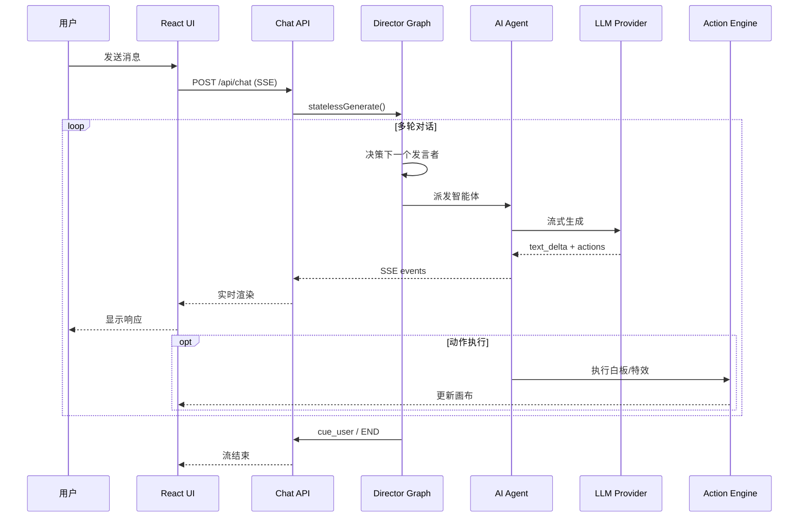

# [OpenMAIC] 开源项目深度研究报告

**仓库：** https://github.com/THU-MAIC/OpenMAIC
**研究日期：** 2026-03-20
**报告版本：** v1.0
**研究者：** Claude AI Agent

---

## 📋 执行摘要（Executive Summary）

- **项目是什么：** 一个开源的 AI 多智能体互动课堂平台，可将任何主题或文档转化为沉浸式的互动学习体验
- **解决什么问题：** 解决在线教育缺乏互动性、个性化不足的问题，通过多智能体编排实现 AI 教师和 AI 同学的实时互动教学
- **技术成熟度：** ⭐⭐⭐⭐⭐ (5/5)
- **适用场景：**
  1. 在线教育与培训（企业内训、学校课程）
  2. 个人学习助手（快速学习新知识领域）
  3. 会议演示与知识分享（自动生成演示文稿）
- **推荐指数：** 生产部署 / 贡献 / 使用
- **最大亮点：**
  1. **LangGraph 多智能体编排** — 使用状态机实现复杂的智能体协作逻辑
  2. **双阶段生成管道** — 大纲生成 + 场景内容生成的分层架构
  3. **28+ 动作类型** — 支持语音、白板、特效等丰富的课堂互动
- **主要风险：**
  1. 高度依赖 LLM API 调用，成本较高
  2. 前端代码复杂度高，学习曲线较陡
  3. 生产部署需要配置多个服务提供商

---

## 🏷️ 第一章：项目身份与定位

### 1.1 基本信息

| 指标 | 值 |
|------|-----|
| 开源协议 | AGPL-3.0 |
| 主语言 | TypeScript (100%) |
| 框架版本 | Next.js 16.1.2 |
| React 版本 | 19.2.3 |
| Node.js 要求 | >= 20.9.0 |
| 包管理器 | pnpm 10.28.0 |
| 论文发表 | JCST 2026 (Journal of Computer Science and Technology) |
| 在线演示 | https://open.maic.chat/ |

### 1.2 问题域分析

OpenMAIC 解决的核心问题是 **在线教育的互动性和个性化不足**：

1. **传统 MOOC 的局限**：视频内容被动观看，缺乏实时互动
2. **知识传递效率低**：没有针对性的讲解和即时反馈
3. **学习体验单一**：无法模拟真实课堂的讨论氛围
4. **内容制作成本高**：需要专业团队制作教学视频

**解决方案**：通过 AI 多智能体技术，实现：
- 一键生成完整的课程内容（幻灯片、测验、互动实验）
- AI 教师实时讲解，AI 同学参与讨论
- 白板演示、语音讲解、实时问答

### 1.3 同类项目对比

| 维度 | OpenMAIC | 传统 LMS (Moodle) | AI 笔记 (Notion AI) |
|------|----------|-------------------|---------------------|
| 多智能体互动 | ✅ 完整支持 | ❌ 无 | ❌ 无 |
| 自动生成课程 | ✅ 一键生成 | ❌ 手动创建 | ⚠️ 部分支持 |
| 实时语音讲解 | ✅ TTS + ASR | ❌ 无 | ❌ 无 |
| 白板演示 | ✅ 实时绘制 | ❌ 无 | ❌ 无 |
| 导出能力 | ✅ PPTX + HTML | ✅ SCORM | ⚠️ 有限 |
| 开源程度 | ✅ 完全开源 | ✅ 开源 | ❌ 商业 |

---

## 🔧 第二章：技术栈全景

### 2.1 技术栈速览

```
运行时:     Node.js 20+ (推荐 22+)
框架:       Next.js 16.1.2 (App Router)
前端:       React 19.2.3 + TypeScript 5
状态管理:   Zustand 5.0.10
样式:       Tailwind CSS 4
AI 编排:    LangGraph 1.1 + Vercel AI SDK 6
数据库:     Dexie (IndexedDB) - 本地存储
构建:       Next.js 内置 (Turbopack)
部署:       Docker + Vercel
```

### 2.2 核心依赖分析

| 依赖 | 版本 | 用途 | 风险 |
|------|------|------|------|
| @langchain/langgraph | 1.1.1 | 多智能体状态编排 | 低 - 稳定 |
| ai (Vercel AI SDK) | 6.0.42 | LLM 统一接口 | 低 - 活跃 |
| @xyflow/react | 12.10.0 | 流程图/节点编辑 | 低 |
| prosemirror-* | 最新 | 富文本编辑 | 中 - 复杂 |
| @napi-rs/canvas | 0.1.88 | 服务端 Canvas 渲染 | 中 - Native |
| pptxgenjs | workspace | PPT 生成 | 低 - 自维护 |
| katex | 0.16.33 | LaTeX 公式渲染 | 低 |

### 2.3 支持的 AI 提供商

项目支持 **10+ 主流 AI 提供商**，通过统一的 Provider 抽象层实现：

| 提供商 | 类型 | 特色模型 |
|--------|------|----------|
| OpenAI | 原生 | GPT-5, GPT-4o, o3/o4 系列 |
| Anthropic | 原生 | Claude Opus 4.6, Sonnet 4.6 |
| Google | 原生 | Gemini 3.1 Pro/Flash |
| GLM (智谱) | OpenAI 兼容 | GLM-5, GLM-4.7, GLM-4.6V |
| DeepSeek | OpenAI 兼容 | DeepSeek-Chat, DeepSeek-Reasoner |
| Qwen (通义) | OpenAI 兼容 | Qwen3.5 Flash/Plus, Qwen3-Max |
| Kimi (月之暗面) | OpenAI 兼容 | Kimi K2.5, K2 Thinking |
| MiniMax | Anthropic 兼容 | MiniMax M2.5, M2.1 |
| 硅基流动 | OpenAI 兼容 | 多模型代理平台 |
| 豆包 (字节) | OpenAI 兼容 | Doubao Seed 系列 |

---

## 🗂️ 第三章：仓库结构

### 3.1 目录树（注释版）

```
OpenMAIC-main/
├── app/                        # Next.js App Router
│   ├── api/                    #   服务端 API 路由 (~25 个端点)
│   │   ├── generate/           #     场景生成管道
│   │   │   ├── scene-outlines-stream/  # 大纲流式生成
│   │   │   ├── scene-content/  #     场景内容生成
│   │   │   ├── scene-actions/  #     动作序列生成
│   │   │   ├── agent-profiles/ #     智能体配置生成
│   │   │   ├── image/          #     图像生成
│   │   │   ├── video/          #     视频生成
│   │   │   └── tts/            #     语音合成
│   │   ├── generate-classroom/ #     异步课堂生成任务
│   │   ├── chat/               #     多智能体对话 (SSE 流式)
│   │   ├── pbl/                #     项目式学习端点
│   │   ├── parse-pdf/          #     PDF 解析
│   │   ├── quiz-grade/         #     测验评分
│   │   ├── web-search/         #     网络搜索
│   │   └── transcription/      #     语音识别
│   ├── classroom/[id]/         #   课堂播放页面
│   ├── generation-preview/      #   生成预览页面
│   ├── layout.tsx              #   根布局
│   └── page.tsx                #   首页 (课程生成入口)
│
├── lib/                        # 核心业务逻辑
│   ├── generation/             #   双阶段生成管道
│   │   ├── outline-generator.ts      # 大纲生成
│   │   ├── scene-generator.ts        # 场景生成
│   │   ├── scene-builder.ts          # 场景构建
│   │   ├── pipeline-runner.ts        # 管道执行器
│   │   └── action-parser.ts          # 动作解析
│   │
│   ├── orchestration/          #   LangGraph 多智能体编排
│   │   ├── director-graph.ts         # 状态机图定义
│   │   ├── director-prompt.ts        # 导演决策提示
│   │   ├── prompt-builder.ts         # 提示构建器
│   │   ├── tool-schemas.ts           # 工具模式定义
│   │   └── stateless-generate.ts     # 无状态生成
│   │
│   ├── playback/               #   播放引擎
│   │   ├── engine.ts                 # 状态机 (idle→playing→live)
│   │   └── types.ts                  # 播放类型定义
│   │
│   ├── action/                 #   动作执行引擎
│   │   └── engine.ts                 # 28+ 动作执行器
│   │
│   ├── ai/                     #   LLM 提供商抽象
│   │   ├── providers.ts              # 统一提供商配置
│   │   ├── llm.ts                    # LLM 调用封装
│   │   └── thinking-context.ts       # 思考模式上下文
│   │
│   ├── api/                    #   Stage API 门面
│   │   ├── stage-api.ts              # 统一 API 入口
│   │   ├── stage-api-canvas.ts       # 画布操作
│   │   ├── stage-api-whiteboard.ts   # 白板操作
│   │   └── stage-api-element.ts      # 元素操作
│   │
│   ├── store/                  #   Zustand 状态存储
│   │   ├── canvas.ts                 # 画布状态
│   │   ├── stage.ts                  # 舞台状态
│   │   ├── settings.ts               # 设置状态
│   │   └── snapshot.ts               # 快照状态
│   │
│   ├── audio/                  #   音频处理
│   │   ├── tts-providers.ts          # TTS 提供商
│   │   └── asr-providers.ts          # ASR 提供商
│   │
│   ├── media/                  #   媒体生成
│   │   ├── image-providers.ts        # 图像生成
│   │   ├── video-providers.ts        # 视频生成
│   │   └── media-orchestrator.ts     # 媒体编排器
│   │
│   ├── export/                 #   导出功能
│   │   ├── use-export-pptx.ts        # PPTX 导出
│   │   └── html-parser/              # HTML 解析
│   │
│   ├── pbl/                    #   项目式学习
│   │   ├── types.ts                  # PBL 类型定义
│   │   ├── generate-pbl.ts           # PBL 生成
│   │   └── mcp/                      # MCP 工具
│   │
│   ├── types/                  #   TypeScript 类型定义
│   │   ├── stage.ts                  # 舞台/场景类型
│   │   ├── action.ts                 # 动作类型 (28+)
│   │   ├── slides.ts                 # 幻灯片类型
│   │   ├── chat.ts                   # 聊天类型
│   │   └── provider.ts               # 提供商类型
│   │
│   ├── i18n/                   #   国际化
│   │   ├── index.ts                  # i18n 入口
│   │   ├── zh.ts                     # 中文
│   │   └── en.ts                     # 英文
│   │
│   └── hooks/                  #   React 自定义 Hooks (55+)
│
├── components/                 # React UI 组件
│   ├── slide-renderer/         #   Canvas 幻灯片渲染器
│   │   ├── Editor/             #     编辑画布
│   │   └── components/element/ #     元素渲染器
│   │
│   ├── scene-renderers/        #   场景渲染器
│   │   ├── QuizRenderer.tsx          # 测验渲染
│   │   ├── InteractiveRenderer.tsx   # 互动渲染
│   │   └── PBLRenderer.tsx           # PBL 渲染
│   │
│   ├── generation/             #   生成工具栏和进度
│   ├── chat/                   #   聊天区域
│   ├── settings/               #   设置面板
│   ├── whiteboard/             #   SVG 白板
│   ├── agent/                  #   智能体头像和配置
│   ├── roundtable/             #   圆桌讨论
│   ├── ai-elements/            #   AI 交互元素
│   └── ui/                     #   基础 UI 组件 (shadcn/ui)
│
├── packages/                   # 工作区包
│   ├── pptxgenjs/              #   定制的 PPT 生成库
│   └── mathml2omml/            #   MathML → Office Math 转换
│
├── skills/                     # OpenClaw 技能
│   └── openmaic/               #   消息应用集成 SOP
│
├── configs/                    # 共享配置
│   ├── animation.ts            #   动画配置
│   ├── shapes.ts               #   形状定义
│   ├── font.ts                 #   字体配置
│   └── theme.ts                #   主题配置
│
├── public/                     # 静态资源
│   └── logos/                  #   AI 提供商图标
│
├── .env.example                # 环境变量模板
├── package.json                # 项目配置
├── tsconfig.json               # TypeScript 配置
├── tailwind.config.ts          # Tailwind 配置
└── docker-compose.yml          # Docker 部署配置
```

### 3.2 入口点地图

| 入口类型 | 文件路径 | 说明 |
|---------|---------|------|
| Web App | `app/page.tsx` | 首页 - 课程生成入口 |
| Classroom | `app/classroom/[id]/page.tsx` | 课堂播放页面 |
| Chat API | `app/api/chat/route.ts` | SSE 流式对话 |
| Generate API | `app/api/generate-classroom/route.ts` | 异步课堂生成 |
| PBL Chat | `app/api/pbl/chat/route.ts` | 项目式学习对话 |

---

## 🏛️ 第四章：架构设计

### 4.1 架构模式识别

**主要模式：** 事件驱动的状态机架构 + 分层架构

**核心架构图：**



### 4.2 多智能体编排架构

**LangGraph 状态机拓扑：**

```
  START → director ──(end)──→ END
              │
              └─(next)→ agent_generate ──→ director (loop)
```

**Director 节点决策逻辑：**
- **单智能体模式**：纯代码逻辑，无需 LLM 调用
  - Turn 0：派发唯一智能体
  - Turn 1+：提示用户发言
- **多智能体模式**：LLM 驱动决策
  - 首回合 + 触发智能体：直接派发
  - 其他回合：LLM 决定下一个发言者

### 4.3 播放引擎状态机



**状态说明：**
- `idle`：初始状态，等待开始
- `playing`：播放讲座内容
- `paused`：暂停，可恢复
- `live`：实时互动模式（用户打断或讨论）

### 4.4 层次架构分析

| 层 | 目录 | 职责 | 依赖方向 |
|----|------|------|---------|
| 表现层 | `components/`, `app/` | UI 渲染、用户交互 | → 业务层 |
| API 层 | `app/api/` | HTTP 路由、SSE 流式 | → 业务层 |
| 业务层 | `lib/playback/`, `lib/action/` | 播放控制、动作执行 | → 编排层 |
| 编排层 | `lib/orchestration/` | 智能体调度、对话管理 | → 基础设施 |
| 基础设施层 | `lib/ai/`, `lib/audio/`, `lib/media/` | LLM/TTS/Media 抽象 | 无外部依赖 |

---

## ⚙️ 第五章：核心功能解析

### 5.1 功能矩阵

| 功能 | 重要性 | 实现文件 | 完成度 |
|------|--------|---------|--------|
| 课程生成 | 🔴 核心 | `lib/generation/` | ✅ 完整 |
| 多智能体对话 | 🔴 核心 | `lib/orchestration/` | ✅ 完整 |
| 幻灯片渲染 | 🔴 核心 | `components/slide-renderer/` | ✅ 完整 |
| 白板演示 | 🔴 核心 | `components/whiteboard/`, `lib/action/engine.ts` | ✅ 完整 |
| 语音合成 | 🟡 重要 | `lib/audio/tts-providers.ts` | ✅ 完整 |
| 测验评分 | 🟡 重要 | `app/api/quiz-grade/` | ✅ 完整 |
| 项目式学习 | 🟡 重要 | `lib/pbl/` | ✅ 完整 |
| 网络搜索 | 🟢 增强 | `app/api/web-search/` | ✅ 完整 |
| 视频生成 | 🟢 增强 | `lib/media/video-providers.ts` | ⚠️ 部分 |
| PDF 解析 | 🟢 增强 | `app/api/parse-pdf/` | ✅ 完整 |

### 5.2 核心功能 #1：双阶段课程生成

**调用链：**

```
用户输入主题/文档
  └── POST /api/generate-classroom
      └── createGenerationSession()           [lib/generation/pipeline-runner.ts]
          └── Stage 1: generateSceneOutlinesFromRequirements()
              │   [lib/generation/outline-generator.ts]
              │   └── LLM → JSON 大纲列表
              │
              └── Stage 2: generateFullScenes()
                  │   [lib/generation/scene-generator.ts]
                  │   └── 并行生成每个场景
                  │       ├── generateSceneContent() → 幻灯片/测验/互动内容
                  │       └── generateSceneActions() → 动作序列 (语音/白板/特效)
                  │
                  └── TTS 后处理：为每个 speech 动作生成音频
```

**关键代码片段：**

```typescript
// lib/generation/pipeline-runner.ts
export async function runGenerationPipeline(
  session: GenerationSession,
  callbacks: GenerationCallbacks,
): Promise<GenerationResult> {
  // Stage 1: Generate outlines
  const outlines = await generateSceneOutlinesFromRequirements(
    session.userRequirements,
    session.agents,
    session.languageModel,
    { onProgress: callbacks.onOutlineProgress }
  );

  // Stage 2: Generate scene content in parallel
  const scenes = await generateFullScenes(
    outlines,
    session,
    { onSceneProgress: callbacks.onSceneProgress }
  );

  return { scenes, outlines };
}
```

**设计决策：**
- 大纲生成确保整体结构一致性
- 场景内容并行生成提高效率
- 动作序列与内容分离，便于回放

### 5.3 核心功能 #2：多智能体对话

**调用链：**

```
POST /api/chat (SSE)
  └── statelessGenerate()                      [lib/orchestration/stateless-generate.ts]
      └── createOrchestrationGraph().stream()  [lib/orchestration/director-graph.ts]
          │
          ├── directorNode() 决策
          │   ├── 单智能体：代码逻辑
          │   └── 多智能体：LLM 决策下一个发言者
          │
          └── agentGenerateNode() 生成
              └── buildStructuredPrompt() → LLM Stream
                  └── parseStructuredChunk() 解析文本 + 动作
                      └── SSE 推送事件
                          ├── agent_start
                          ├── text_delta
                          ├── action
                          └── agent_end
```

**关键代码片段：**

```typescript
// lib/orchestration/director-graph.ts
async function directorNode(state, config) {
  // Turn limit check
  if (state.turnCount >= state.maxTurns) {
    return { shouldEnd: true };
  }

  // Single agent: code-only logic
  if (isSingleAgent) {
    if (state.turnCount === 0) {
      return { currentAgentId: agentId, shouldEnd: false };
    }
    write({ type: 'cue_user', data: { fromAgentId: agentId } });
    return { shouldEnd: true };
  }

  // Multi agent: LLM-based decision
  const decision = await llm.generate(buildDirectorPrompt(...));
  if (decision.nextAgentId === 'USER') {
    write({ type: 'cue_user', data: {} });
    return { shouldEnd: true };
  }
  return { currentAgentId: decision.nextAgentId, shouldEnd: false };
}
```

### 5.4 核心功能 #3：动作执行引擎

**支持的 28+ 动作类型：**

| 类别 | 动作 | 说明 |
|------|------|------|
| **即时特效** | spotlight, laser | 元素高亮、激光笔 |
| **语音** | speech | AI 讲师旁白 |
| **白板** | wb_open, wb_close | 白板开关 |
| | wb_draw_text | 绘制文本 |
| | wb_draw_shape | 绘制形状 |
| | wb_draw_chart | 绘制图表 |
| | wb_draw_latex | 绘制公式 |
| | wb_draw_table | 绘制表格 |
| | wb_draw_line | 绘制线条/箭头 |
| | wb_clear, wb_delete | 清除/删除 |
| **视频** | play_video | 播放视频元素 |
| **讨论** | discussion | 触发讨论 |

**执行模式：**
- **Fire-and-forget**：spotlight, laser → 立即返回，不阻塞
- **Synchronous**：speech, wb_* → 等待完成后再执行下一个

---

## 🌊 第六章：数据流与状态管理

### 6.1 核心数据模型

```mermaid
erDiagram
    Stage ||--o{ Scene : "contains"
    Stage { string id, string name, string description, datetime createdAt }

    Scene ||--o| SlideContent : "slide"
    Scene ||--o| QuizContent : "quiz"
    Scene ||--o| InteractiveContent : "interactive"
    Scene ||--o| PBLContent : "pbl"
    Scene { string id, string stageId, enum type, string title, int order }

    Scene ||--o{ Action : "executes"
    Action { string id, enum type, json params }

    Scene ||--o{ Whiteboard : "explains"
    Whiteboard { string id, json elements }

    Agent { string id, string name, string role, string[] allowedActions }
```

### 6.2 主要请求时序图



### 6.3 状态管理架构

**Zustand Stores：**

| Store | 文件 | 职责 |
|-------|------|------|
| useCanvasStore | `lib/store/canvas.ts` | 画布状态、白板、特效 |
| useStageStore | `lib/store/stage.ts` | 舞台、场景列表 |
| useSettingsStore | `lib/store/settings.ts` | 用户设置、提供商配置 |
| useSnapshotStore | `lib/store/snapshot.ts` | 播放快照 |
| useMediaGenerationStore | `lib/store/media-generation.ts` | 媒体生成任务状态 |

---

## 📊 第七章：工程质量评估

### 7.1 工程实践评分卡

| 维度 | 评分 | 证据 |
|------|------|------|
| 代码风格一致性 | ✅ 优秀 | ESLint + Prettier 配置完整 |
| 类型安全 | ✅ 优秀 | TypeScript strict 模式，完整类型定义 |
| 模块化 | ✅ 优秀 | 清晰的目录结构，职责分离 |
| API 设计 | ✅ 优秀 | RESTful + SSE，统一错误处理 |
| 文档质量 | ⚠️ 一般 | README 完整，但缺少 API 文档 |
| 测试覆盖 | ⚠️ 一般 | 缺少单元测试和 E2E 测试 |
| CI/CD | ✅ 良好 | GitHub Actions CI 流水线 |
| 国际化 | ✅ 优秀 | 完整的 i18n 支持 (中/英) |
| 安全实践 | ✅ 良好 | SSRF 防护，API Key 不硬编码 |

**综合质量评分：** 🌟🌟🌟🌟☆ (4.5/5)

### 7.2 代码质量亮点

1. **LangGraph 状态机**：使用声明式状态图管理复杂的多智能体交互
2. **统一动作系统**：28+ 动作类型，统一的执行引擎
3. **Provider 抽象**：10+ AI 提供商的统一接口
4. **流式处理**：SSE 实时推送，支持中断和恢复
5. **类型安全**：完整的 TypeScript 类型定义

### 7.3 待改进领域

1. **测试覆盖**：缺少自动化测试
2. **文档**：缺少 API 文档和架构文档
3. **性能监控**：缺少 OpenTelemetry 集成
4. **错误边界**：部分组件缺少错误边界处理

---

## 🚀 第八章：部署与运维指南

### 8.1 快速启动（开发环境）

```bash
# 前置条件：Node.js 20+, pnpm 10+
git clone https://github.com/THU-MAIC/OpenMAIC.git
cd OpenMAIC

# 安装依赖
pnpm install

# 配置环境变量
cp .env.example .env.local
# 编辑 .env.local，填入至少一个 LLM API Key

# 启动开发服务器
pnpm dev
# 访问 http://localhost:3000
```

### 8.2 配置项参考

| 变量名 | 类型 | 默认值 | 必须 | 说明 |
|--------|------|--------|------|------|
| OPENAI_API_KEY | string | - | ❌ | OpenAI API 密钥 |
| ANTHROPIC_API_KEY | string | - | ❌ | Claude API 密钥 |
| GOOGLE_API_KEY | string | - | ❌ | Gemini API 密钥 |
| DEEPSEEK_API_KEY | string | - | ❌ | DeepSeek API 密钥 |
| GLM_API_KEY | string | - | ❌ | 智谱 GLM API 密钥 |
| QWEN_API_KEY | string | - | ❌ | 通义千问 API 密钥 |
| TTS_AZURE_API_KEY | string | - | ❌ | Azure TTS 密钥 |
| TTS_OPENAI_API_KEY | string | - | ❌ | OpenAI TTS 密钥 |
| PDF_MINERU_BASE_URL | string | - | ❌ | MinerU PDF 解析服务 |
| TAVILY_API_KEY | string | - | ❌ | Tavily 网络搜索 |
| DEFAULT_MODEL | string | - | ❌ | 默认模型 (如 google:gemini-3-flash-preview) |

**注意：** 至少需要配置一个 LLM 提供商的 API Key。

### 8.3 生产部署方案对比

| 方案 | 复杂度 | 适用规模 | 文档完整度 |
|------|--------|---------|-----------|
| Vercel | 低 | 小中型 | ✅ 完整 |
| Docker Compose | 低 | 小型 | ✅ 完整 |
| Kubernetes | 高 | 大型 | ⚠️ 部分 |

### 8.4 Docker 部署

```bash
# 配置环境变量
cp .env.example .env.local
# 编辑 .env.local

# 构建并启动
docker compose up --build

# 后台运行
docker compose up -d
```

### 8.5 Vercel 一键部署

[](https://vercel.com/new/clone?repository-url=https%3A%2F%2Fgithub.com%2FTHU-MAIC%2FOpenMAIC)

---

## 📚 第九章：学习路径与贡献指南

### 9.1 前置知识要求

**必备：**
- TypeScript / JavaScript
- React 19 (Hooks, Context)
- Next.js App Router
- REST API 设计

**推荐：**
- Zustand 状态管理
- LangGraph / LangChain
- SSE (Server-Sent Events)
- Canvas / SVG 绘图

### 9.2 分阶段学习路线

```
Week 1-2 【定向】
  → 阅读 README + 在线演示
  → 本地跑通开发环境
  → 生成一个简单的课程，观察整个流程

Week 3-4 【理解核心】
  → 阅读 lib/types/ 目录，理解数据模型
  → 追踪 POST /api/chat 的完整请求链路
  → 阅读 lib/playback/engine.ts，理解状态机

Week 5-6 【深入模块】
  → 选择一个感兴趣的模块深入阅读
    - generation: 课程生成管道
    - orchestration: 多智能体编排
    - action: 动作执行引擎
  → 尝试修改一个小功能，跑通测试

Week 7+ 【贡献】
  → 认领 GitHub Issues 中的 "good first issue"
  → 提交第一个 Pull Request
```

### 9.3 推荐的代码阅读顺序

1. `lib/types/` — 理解核心数据类型
2. `lib/orchestration/director-graph.ts` — 理解多智能体编排
3. `lib/playback/engine.ts` — 理解播放状态机
4. `lib/action/engine.ts` — 理解动作执行
5. `lib/generation/pipeline-runner.ts` — 理解生成管道
6. `app/api/chat/route.ts` — 理解 SSE 流式 API

---

## 🔍 附录

### A. 已知问题与局限

1. **高并发限制**：当前架构为单实例设计，横向扩展需要额外工作
2. **Windows 兼容性**：部分路径处理可能存在问题
3. **测试覆盖不足**：缺少自动化测试，依赖手动测试
4. **视频生成依赖外部服务**：需要配置第三方视频生成 API

### B. 相关资源

| 资源 | 链接 |
|------|------|
| 官方网站 | https://open.maic.chat/ |
| GitHub 仓库 | https://github.com/THU-MAIC/OpenMAIC |
| 学术论文 | https://jcst.ict.ac.cn/en/article/doi/10.1007/s11390-025-6000-0 |
| Discord 社区 | https://discord.gg/PtZaaTbH |
| 飞书交流群 | 参见 community/feishu.md |

### C. OpenClaw 集成

OpenMAIC 支持通过 [OpenClaw](https://github.com/openclaw/openclaw) 从消息应用（飞书、Slack、Telegram 等）直接生成课堂：

```bash
# 安装 OpenMAIC 技能
clawhub install openmaic

# 配置访问码（托管模式）
# 或配置本地服务地址（自托管模式）
```

### D. 报告置信度说明

| 章节 | 置信度 | 说明 |
|------|--------|------|
| 项目概述 | 🟢 高 | 基于 README 和官方文档 |
| 架构分析 | 🟢 高 | 基于代码直接分析 |
| 技术栈 | 🟢 高 | 基于 package.json 和代码 |
| 性能评估 | 🟡 中 | 基于代码模式推断，未实测 |
| 部署指南 | 🟢 高 | 基于官方文档和 Docker 配置 |

---

## 📄 许可证

本项目采用 [GNU Affero General Public License v3.0](LICENSE) 许可证。

商业许可咨询请联系：**thu_maic@tsinghua.edu.cn**

---

*本报告由 Claude AI 自动生成，基于对项目源代码的深度分析。*
