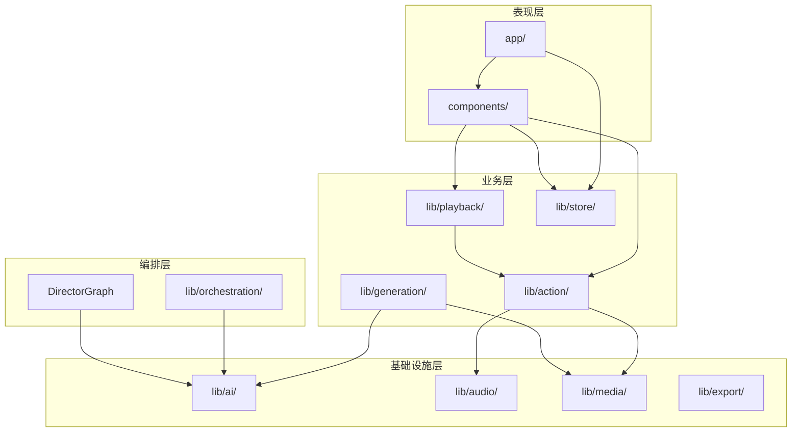

# OpenMAIC 项目概览分析报告

**仓库:** THU-MAIC/OpenMAIC
**分析日期:** 2026-03-20
**分析者:** Claude AI Agent
**请求者背景:** INTERMEDIATE

---

## 1. 项目身份与目的

### 项目是什么

OpenMAIC (Open Multi-Agent Interactive Classroom) 是一个开源的 AI 多智能体互动课堂平台，可以将任何主题或文档转化为沉浸式的互动学习体验。

### 解决什么问题

| 问题 | 传统方案 | OpenMAIC 方案 |
|------|----------|---------------|
| 在线教育缺乏互动 | 被动观看视频 | AI 教师/同学实时互动 |
| 内容制作成本高 | 需要专业团队 | 一键自动生成课程 |
| 学习体验单一 | 固定内容 | 个性化、可打断、可讨论 |
| 知识传递效率低 | 无即时反馈 | 实时问答和白板演示 |

### 目标受众

1. **教育机构** - 学校、培训中心、企业内训
2. **个人学习者** - 快速学习新知识领域
3. **内容创作者** - 快速生成教学演示内容
4. **开发者** - 基于 AI 教育平台进行二次开发

### 项目成熟度

| 指标 | 状态 | 证据 |
|------|------|------|
| 代码质量 | ✅ 稳定 | TypeScript strict 模式，完整类型定义 |
| 文档完整度 | ✅ 良好 | README 详细，有在线演示 |
| 社区活跃度 | ✅ 活跃 | GitHub Issues, Discord, 飞书群 |
| 学术验证 | ✅ 已发表 | JCST 2026 论文 |
| 生产可用性 | ✅ 可用 | 在线演示 https://open.maic.chat/ |

### 关键指标

| 指标 | 值 |
|------|-----|
| License | AGPL-3.0 |
| 主要语言 | TypeScript (100%) |
| 框架 | Next.js 16.1.2 |
| React 版本 | 19.2.3 |
| Node.js 要求 | >= 20.9.0 |
| 在线演示 | https://open.maic.chat/ |
| 论文 | JCST 2026 |

---

## 2. 技术栈指纹

### 主要编程语言

| 语言 | 用途 | 占比 |
|------|------|------|
| TypeScript | 全栈开发 | ~95% |
| CSS | 样式 | ~3% |
| JavaScript | 配置文件 | ~2% |

### 核心框架和库

```
前端框架:
├── Next.js 16.1.2          # App Router, SSR/SSG
├── React 19.2.3            # UI 组件
├── Tailwind CSS 4          # 样式系统
└── Zustand 5.0.10          # 状态管理

AI 编排:
├── @langchain/langgraph 1.1.1  # 多智能体状态机
├── ai (Vercel AI SDK) 6.0.42   # LLM 统一接口
├── @ai-sdk/anthropic 3.0.23    # Claude 支持
├── @ai-sdk/google 3.0.13       # Gemini 支持
└── @ai-sdk/openai 3.0.13       # OpenAI 支持

UI 组件:
├── @radix-ui/*             # 无障碍组件原语
├── @xyflow/react 12.10.0   # 节点图/流程图
├── lucide-react            # 图标库
└── motion (framer-motion)  # 动画库

编辑器:
├── prosemirror-*           # 富文本编辑
├── katex 0.16.33           # LaTeX 公式
└── echarts 6.0.0           # 图表库

工具库:
├── lodash 4.17.21          # 工具函数
├── zod 4.3.5               # 数据验证
├── nanoid 5.1.6            # ID 生成
└── immer 11.1.3            # 不可变状态
```

### 构建工具和包管理器

| 工具 | 版本 | 用途 |
|------|------|------|
| pnpm | 10.28.0 | 包管理器 |
| Next.js 内置 | - | 构建 (Turbopack) |
| ESLint | 9 | 代码检查 |
| Prettier | 3.8.1 | 代码格式化 |
| TypeScript | 5 | 类型检查 |

### 测试框架

⚠️ **注意:** 项目当前缺少自动化测试框架配置。建议添加：
- Vitest (单元测试)
- Playwright (E2E 测试)

### 基础设施 / 运行时要求

| 要求 | 版本 | 说明 |
|------|------|------|
| Node.js | >= 20.9.0 | 推荐 22+ |
| pnpm | >= 10 | 包管理 |
| 内存 | 4GB+ | 推荐 8GB+ |
| 外部服务 | - | 至少一个 LLM API |

---

## 3. 高层架构

### 架构模式

```
┌─────────────────────────────────────────────────────────────────┐
│                         OpenMAIC 架构                           │
├─────────────────────────────────────────────────────────────────┤
│                                                                 │
│  ┌─────────────┐    ┌─────────────┐    ┌─────────────┐        │
│  │   Browser   │    │   Next.js   │    │   Server    │        │
│  │   Client    │◄──►│   App Router│◄──►│   Actions   │        │
│  └─────────────┘    └─────────────┘    └─────────────┘        │
│        │                  │                   │                │
│        ▼                  ▼                   ▼                │
│  ┌─────────────────────────────────────────────────────┐      │
│  │                   React Components                    │      │
│  │  ┌─────────┐ ┌─────────┐ ┌─────────┐ ┌─────────┐   │      │
│  │  │  Stage  │ │  Chat   │ │ Whiteboard│ │ Settings │   │      │
│  │  └─────────┘ └─────────┘ └─────────┘ └─────────┘   │      │
│  └─────────────────────────────────────────────────────┘      │
│        │                                                       │
│        ▼                                                       │
│  ┌─────────────────────────────────────────────────────┐      │
│  │                   Zustand Stores                      │      │
│  │  ┌──────────┐ ┌──────────┐ ┌──────────┐            │      │
│  │  │ Canvas   │ │  Stage   │ │ Settings │            │      │
│  │  └──────────┘ └──────────┘ └──────────┘            │      │
│  └─────────────────────────────────────────────────────┘      │
│        │                                                       │
│        ▼                                                       │
│  ┌─────────────────────────────────────────────────────┐      │
│  │                   Core Engines                        │      │
│  │  ┌──────────────┐  ┌──────────────┐  ┌───────────┐  │      │
│  │  │   Playback   │  │    Action    │  │Generation │  │      │
│  │  │   Engine     │  │    Engine    │  │ Pipeline  │  │      │
│  │  └──────────────┘  └──────────────┘  └───────────┘  │      │
│  └─────────────────────────────────────────────────────┘      │
│        │                                                       │
│        ▼                                                       │
│  ┌─────────────────────────────────────────────────────┐      │
│  │               LangGraph Orchestration                 │      │
│  │  ┌──────────────────────────────────────────────┐   │      │
│  │  │  Director ──► Agent_Generate ──► Director    │   │      │
│  │  │    (loop)                                     │   │      │
│  │  └──────────────────────────────────────────────┘   │      │
│  └─────────────────────────────────────────────────────┘      │
│        │                                                       │
│        ▼                                                       │
│  ┌─────────────────────────────────────────────────────┐      │
│  │                   AI Providers                        │      │
│  │  ┌────────┐ ┌────────┐ ┌────────┐ ┌────────┐       │      │
│  │  │OpenAI  │ │Claude  │ │Gemini  │ │ GLM/... │       │      │
│  │  └────────┘ └────────┘ └────────┘ └────────┘       │      │
│  └─────────────────────────────────────────────────────┘      │
│                                                                 │
└─────────────────────────────────────────────────────────────────┘
```

### 架构风格

| 风格 | 采用程度 | 说明 |
|------|----------|------|
| 分层架构 | ✅ 主要 | 前端/业务/编排/基础设施 |
| 事件驱动 | ✅ 主要 | SSE 流式、状态机事件 |
| 微内核 | ⚠️ 部分 | Provider 插件化 |
| CQRS | ❌ 未采用 | - |

### 架构特点

1. **状态机驱动**: PlaybackEngine 和 DirectorGraph 都采用状态机模式
2. **流式处理**: SSE 实现实时数据推送
3. **Provider 抽象**: 10+ AI 提供商通过统一接口访问
4. **组件化**: React 组件高度模块化

---

## 4. 仓库结构图

```
OpenMAIC-main/
├── 📁 app/                        # Next.js App Router (路由层)
│   ├── 📁 api/                    #   API 端点 (~25 个)
│   │   ├── 📁 generate/           #     生成相关 API
│   │   ├── 📁 chat/               #     对话 API (SSE)
│   │   ├── 📁 pbl/                #     项目式学习 API
│   │   └── 📄 *.ts                #     其他端点
│   ├── 📁 classroom/[id]/         #   课堂播放页面
│   ├── 📁 generation-preview/     #   生成预览页面
│   ├── 📄 layout.tsx              #   根布局
│   └── 📄 page.tsx                #   首页
│
├── 📁 lib/                        # 核心业务逻辑 (业务层)
│   ├── 📁 generation/             #   双阶段生成管道
│   ├── 📁 orchestration/          #   LangGraph 多智能体编排
│   ├── 📁 playback/               #   播放引擎
│   ├── 📁 action/                 #   动作执行引擎
│   ├── 📁 ai/                     #   LLM 提供商抽象
│   ├── 📁 api/                    #   Stage API 门面
│   ├── 📁 store/                  #   Zustand 状态存储
│   ├── 📁 audio/                  #   TTS/ASR 处理
│   ├── 📁 media/                  #   图像/视频生成
│   ├── 📁 export/                 #   导出功能
│   ├── 📁 pbl/                    #   项目式学习
│   ├── 📁 types/                  #   TypeScript 类型定义
│   ├── 📁 i18n/                   #   国际化
│   └── 📁 hooks/                  #   React Hooks (55+)
│
├── 📁 components/                 # React UI 组件 (表现层)
│   ├── 📁 slide-renderer/         #   幻灯片渲染器
│   ├── 📁 scene-renderers/        #   场景渲染器
│   ├── 📁 generation/             #   生成工具栏
│   ├── 📁 chat/                   #   聊天区域
│   ├── 📁 settings/               #   设置面板
│   ├── 📁 whiteboard/             #   白板组件
│   ├── 📁 agent/                  #   智能体组件
│   ├── 📁 ai-elements/            #   AI 交互元素
│   └── 📁 ui/                     #   基础 UI 组件
│
├── 📁 packages/                   # 工作区包
│   ├── 📁 pptxgenjs/              #   PPT 生成库
│   └── 📁 mathml2omml/            #   数学公式转换
│
├── 📁 skills/                     # OpenClaw 技能
│   └── 📁 openmaic/               #   消息应用集成
│
├── 📁 configs/                    # 共享配置
├── 📁 public/                     # 静态资源
│
├── 📄 package.json                # 项目配置
├── 📄 tsconfig.json               # TypeScript 配置
├── 📄 tailwind.config.ts          # Tailwind 配置
├── 📄 docker-compose.yml          # Docker 部署
├── 📄 .env.example                # 环境变量模板
└── 📄 README.md                   # 项目说明
```

### 入口点识别

| 入口类型 | 文件路径 | 说明 |
|---------|---------|------|
| Web 首页 | `app/page.tsx` | 课程生成入口 |
| 课堂播放 | `app/classroom/[id]/page.tsx` | 课堂播放页面 |
| Chat API | `app/api/chat/route.ts` | SSE 流式对话 |
| 生成 API | `app/api/generate-classroom/route.ts` | 异步课堂生成 |
| PBL API | `app/api/pbl/chat/route.ts` | 项目式学习对话 |

### 配置文件

| 文件 | 作用 |
|------|------|
| `package.json` | 依赖、脚本、工作区定义 |
| `tsconfig.json` | TypeScript 编译选项 |
| `tailwind.config.ts` | Tailwind CSS 配置 |
| `.env.example` | 环境变量模板 |
| `.prettierrc` | 代码格式化规则 |
| `.nvmrc` | Node.js 版本锁定 |
| `docker-compose.yml` | Docker 部署配置 |

---

## 5. 核心模块与组件

### 模块依赖图



### 模块职责表

| 模块 | 目录 | 职责 | 耦合度 |
|------|------|------|--------|
| **Generation** | `lib/generation/` | 双阶段课程生成 | 低 - 独立管道 |
| **Orchestration** | `lib/orchestration/` | 多智能体状态编排 | 中 - 依赖 AI |
| **Playback** | `lib/playback/` | 课堂播放状态机 | 低 - 独立引擎 |
| **Action** | `lib/action/` | 动作执行引擎 | 低 - 统一接口 |
| **AI Providers** | `lib/ai/` | LLM 提供商抽象 | 低 - 插件化 |
| **Store** | `lib/store/` | Zustand 状态管理 | 中 - 全局共享 |
| **Slide Renderer** | `components/slide-renderer/` | Canvas 幻灯片渲染 | 中 - 复杂组件 |
| **Whiteboard** | `components/whiteboard/` | SVG 白板组件 | 低 - 独立功能 |

### 边界与耦合分析

**高内聚模块 (适合复用):**
- `lib/ai/providers.ts` - AI 提供商配置
- `lib/action/engine.ts` - 动作执行引擎
- `lib/playback/engine.ts` - 播放引擎

**紧耦合区域 (重构候选):**
- `components/slide-renderer/` 与 `lib/store/canvas.ts` 高度耦合
- `lib/orchestration/` 与 `lib/ai/` 有直接依赖

---

## 6. 数据流概览

### 主要数据流

```
用户输入主题
    │
    ▼
┌─────────────────────────────────────────────────────────────┐
│                    Generation Pipeline                       │
│  ┌─────────────┐     ┌─────────────┐     ┌─────────────┐   │
│  │   Outline   │ ──► │   Scene     │ ──► │   Action    │   │
│  │  Generator  │     │  Generator  │     │  Generator  │   │
│  └─────────────┘     └─────────────┘     └─────────────┘   │
│        │                    │                    │          │
│        ▼                    ▼                    ▼          │
│    JSON 大纲           场景内容             动作序列         │
└─────────────────────────────────────────────────────────────┘
    │
    ▼
┌─────────────────────────────────────────────────────────────┐
│                     Storage (IndexedDB)                      │
│  ┌─────────────┐     ┌─────────────┐     ┌─────────────┐   │
│  │    Stage    │     │   Scenes    │     │   Actions   │   │
│  └─────────────┘     └─────────────┘     └─────────────┘   │
└─────────────────────────────────────────────────────────────┘
    │
    ▼
┌─────────────────────────────────────────────────────────────┐
│                     Playback Engine                          │
│  ┌─────────────┐     ┌─────────────┐     ┌─────────────┐   │
│  │   Speech    │ ──► │  Whiteboard │ ──► │   Effects   │   │
│  │   (TTS)     │     │   Actions   │     │ (spotlight) │   │
│  └─────────────┘     └─────────────┘     └─────────────┘   │
└─────────────────────────────────────────────────────────────┘
    │
    ▼
┌─────────────────────────────────────────────────────────────┐
│                   Live Interaction (SSE)                     │
│  ┌─────────────┐     ┌─────────────┐     ┌─────────────┐   │
│  │   Director  │ ──► │    Agent    │ ──► │   Stream    │   │
│  │   Graph     │     │  Generate   │     │   Events    │   │
│  └─────────────┘     └─────────────┘     └─────────────┘   │
└─────────────────────────────────────────────────────────────┘
    │
    ▼
用户交互 / 导出
```

### 关键数据转换阶段

| 阶段 | 输入 | 输出 | 处理者 |
|------|------|------|--------|
| 大纲生成 | 用户需求 + 文档 | SceneOutline[] | LLM |
| 场景生成 | SceneOutline | Scene (content + actions) | LLM |
| TTS 处理 | SpeechAction.text | audioUrl | TTS Provider |
| 导出 | Scene[] | .pptx / .html | Exporter |

### 异步/事件驱动流

1. **SSE 流式对话**: `POST /api/chat` → 持续推送事件
2. **异步生成任务**: `POST /api/generate-classroom` → 返回 jobId → 轮询状态
3. **媒体生成**: 图像/视频异步生成，通过 Store 追踪状态

---

## 7. 外部集成与依赖

### 第三方服务

| 服务类型 | 提供商 | 必须 | 用途 |
|----------|--------|------|------|
| LLM | OpenAI / Claude / Gemini / GLM | ✅ 至少一个 | 内容生成、对话 |
| TTS | OpenAI / Azure / GLM / Qwen | ❌ | 语音合成 |
| ASR | OpenAI / Qwen | ❌ | 语音识别 |
| 图像生成 | SeeDream / Qwen | ❌ | 幻灯片配图 |
| 视频生成 | SeeDance / Kling / Veo | ❌ | 视频内容 |
| PDF 解析 | MinerU / UnPDF | ❌ | 文档解析 |
| 网络搜索 | Tavily | ❌ | 实时信息 |

### 关键依赖风险

| 依赖 | 风险等级 | 说明 |
|------|----------|------|
| LLM API | 🟡 中 | 成本高，需要监控 |
| @langchain/langgraph | 🟢 低 | 稳定，活跃维护 |
| @napi-rs/canvas | 🟡 中 | Native 模块，跨平台编译 |
| prosemirror-* | 🟡 中 | 复杂度高，定制难度大 |

### 安全与许可

| 项目 | 状态 | 说明 |
|------|------|------|
| 许可证 | AGPL-3.0 | 商业使用需联系授权 |
| 硬编码密钥 | ✅ 无 | 所有密钥通过环境变量 |
| SSRF 防护 | ✅ 有 | `validateUrlForSSRF()` |

---

## TL;DR (5 个关键发现)

1. **🎯 创新性强**: LangGraph 多智能体编排 + 双阶段生成管道，实现真正的 AI 互动课堂
2. **🏗️ 架构清晰**: 分层架构 + 事件驱动，状态机管理复杂交互
3. **🔌 可扩展**: 10+ AI 提供商通过统一接口，易于添加新提供商
4. **⚠️ 测试不足**: 缺少自动化测试，是主要改进点
5. **📚 学术背书**: JCST 2026 论文发表，清华大学团队维护

---

*报告生成日期: 2026-03-20*
*分析工具: Claude AI Agent*
