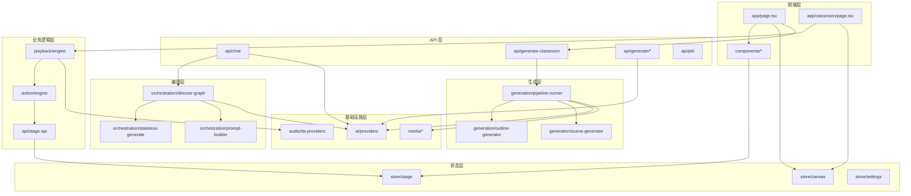

# OpenMAIC 架构深度分析报告

**仓库:** THU-MAIC/OpenMAIC
**分析日期:** 2026-03-20
**分析者:** Claude AI Agent
**已识别技术栈:** Next.js 16 + React 19 + TypeScript + LangGraph + Zustand

---

## 架构模式分析

### 1. 主要架构模式

#### 1.1 分层架构 (Layered Architecture)

项目采用清晰的分层架构，每层职责分明：

| 层级 | 目录 | 职责 | 关键文件 |
|------|------|------|----------|
| **表现层** | `components/`, `app/` | UI 渲染、路由、用户交互 | `app/page.tsx`, `components/` |
| **API 层** | `app/api/` | HTTP 路由、SSE 流式、请求验证 | `app/api/chat/route.ts` |
| **业务逻辑层** | `lib/playback/`, `lib/action/` | 播放控制、动作执行 | `lib/playback/engine.ts` |
| **编排层** | `lib/orchestration/` | 智能体调度、对话管理 | `lib/orchestration/director-graph.ts` |
| **基础设施层** | `lib/ai/`, `lib/audio/`, `lib/media/` | LLM/TTS/Media 抽象 | `lib/ai/providers.ts` |

**选择原因：**
- 清晰的职责分离，便于维护和测试
- 符合 Next.js App Router 的设计哲学
- 支持前后端独立演进

#### 1.2 事件驱动架构 (Event-Driven Architecture)

核心交互通过事件驱动：

```
用户操作 → SSE 事件流 → 状态更新 → UI 响应
```

**证据文件：**
- `app/api/chat/route.ts:135-153` - SSE 事件生成
- `lib/orchestration/stateless-generate.ts` - 事件流生成

#### 1.3 状态机模式 (State Machine Pattern)

播放引擎使用状态机管理生命周期：

```typescript
// lib/playback/engine.ts:7-24
/**
 * State machine:
 *
 *                  start()                  pause()
 *   idle ──────────────────→ playing ──────────────→ paused
 *     ▲                         ▲                       │
 *     │                         │  resume()             │
 *     │                         └───────────────────────┘
 *     │
 *     │  handleEndDiscussion()
 *     │                         confirmDiscussion()
 *     │                         / handleUserInterrupt()
 *     │                              │
 *     │                              ▼         pause()
 *     └──────────────────────── live ──────────────→ paused
 */
```

#### 1.4 策略模式 (Strategy Pattern)

AI 提供商通过策略模式统一：

```typescript
// lib/ai/providers.ts:929-1036
export function getModel(config: ModelConfig): ModelWithInfo {
  switch (providerType) {
    case 'openai':
      return createOpenAI(...).chat(config.modelId);
    case 'anthropic':
      return createAnthropic(...).chat(config.modelId);
    case 'google':
      return createGoogleGenerativeAI(...).chat(config.modelId);
  }
}
```

### 1.5 架构反模式检测

| 反模式 | 状态 | 说明 |
|--------|------|------|
| 循环依赖 | ✅ 无 | 模块依赖清晰 |
| 上帝类 | ⚠️ 部分 | `PlaybackEngine` 职责较多 |
| 硬编码 | ✅ 无 | 配置通过环境变量 |
| 跨层调用 | ⚠️ 部分 | 部分 Hook 直接调用 API |

---

## 模块依赖图

### Mermaid 依赖关系图



### 模块耦合分析

| 模块 | 耦合度 | 说明 |
|------|--------|------|
| `lib/ai/providers` | 🟢 低 | 纯工具模块，无状态 |
| `lib/orchestration/director-graph` | 🟡 中 | 依赖 LangGraph 和 Providers |
| `lib/playback/engine` | 🟡 中 | 依赖 ActionEngine 和 Stores |
| `lib/action/engine` | 🟡 中 | 依赖 StageAPI 和 Stores |
| `components/*` | 🟡 中 | 依赖 Stores 和 Hooks |

### 可复用模块

| 模块 | 复用潜力 | 说明 |
|------|----------|------|
| `lib/ai/providers` | ⭐⭐⭐ | AI 提供商抽象，可独立使用 |
| `lib/generation/pipeline-runner` | ⭐⭐⭐ | 生成管道，可服务端独立使用 |
| `lib/audio/tts-providers` | ⭐⭐ | TTS 抽象 |
| `lib/types/` | ⭐⭐⭐ | 类型定义，可共享 |

---

## 层级分析

### 表现层 (Presentation Layer)

| 目录/文件 | 职责 | 跨层违规 |
|-----------|------|----------|
| `app/page.tsx` | 首页，课程生成入口 | ⚠️ 直接调用 API |
| `app/classroom/[id]/page.tsx` | 课堂播放页面 | 无 |
| `components/slide-renderer/` | 幻灯片渲染 | 无 |
| `components/chat/` | 聊天界面 | ⚠️ 直接调用 API |
| `components/whiteboard/` | 白板组件 | 无 |
| `components/agent/` | 智能体 UI | 无 |

### API 层 (API Layer)

| 目录/文件 | 职责 | 跨层违规 |
|-----------|------|----------|
| `app/api/chat/route.ts` | SSE 对话 API | 无 |
| `app/api/generate-classroom/` | 异步课堂生成 | 无 |
| `app/api/generate/scene-outlines-stream/` | 大纲流式生成 | 无 |
| `app/api/generate/scene-content/` | 场景内容生成 | 无 |
| `app/api/pbl/chat/` | PBL 对话 | 无 |

### 业务逻辑层 (Business Logic Layer)

| 目录/文件 | 职责 | 跨层违规 |
|-----------|------|----------|
| `lib/playback/engine.ts` | 播放状态机 | 无 |
| `lib/action/engine.ts` | 动作执行引擎 | 无 |
| `lib/api/stage-api.ts` | Stage API 门面 | 无 |
| `lib/export/use-export-pptx.ts` | PPT 导出 | 无 |

### 编排层 (Orchestration Layer)

| 目录/文件 | 职责 | 跨层违规 |
|-----------|------|----------|
| `lib/orchestration/director-graph.ts` | LangGraph 状态机 | 无 |
| `lib/orchestration/director-prompt.ts` | 导演决策提示 | 无 |
| `lib/orchestration/prompt-builder.ts` | 提示构建 | 无 |
| `lib/orchestration/stateless-generate.ts` | 无状态生成 | 无 |

### 基础设施层 (Infrastructure Layer)

| 目录/文件 | 职责 | 跨层违规 |
|-----------|------|----------|
| `lib/ai/providers.ts` | AI 提供商统一接口 | 无 |
| `lib/audio/tts-providers.ts` | TTS 提供商 | 无 |
| `lib/audio/asr-providers.ts` | ASR 提供商 | 无 |
| `lib/media/image-providers.ts` | 图像生成 | 无 |
| `lib/media/video-providers.ts` | 视频生成 | 无 |

---

## 接口契约

### 核心 API 接口

#### 1. Chat API

```typescript
// POST /api/chat
// lib/types/chat.ts

interface StatelessChatRequest {
  messages: UIMessage[];           // 对话历史
  storeState: StoreState;          // 客户端状态
  config: {
    agentIds: string[];            // 智能体 ID 列表
    sessionType?: string;
  };
  apiKey: string;
  baseUrl?: string;
  model?: string;
  directorState?: DirectorState;   // 导演状态（多轮对话）
}

interface StatelessEvent {
  type: 'agent_start' | 'text_delta' | 'action' | 'agent_end' | 'cue_user' | 'error';
  data: object;
}
```

#### 2. Generation API

```typescript
// POST /api/generate-classroom
// lib/types/generation.ts

interface UserRequirements {
  topic?: string;                  // 学习主题
  document?: UploadedDocument;     // 上传的文档
  sceneCount?: number;             // 场景数量
  sceneTypes?: SceneType[];        // 场景类型
  language?: string;               // 语言
}

interface GenerationSession {
  id: string;
  userRequirements: UserRequirements;
  agents: AgentInfo[];
  progress: GenerationProgress;
}
```

#### 3. Action 接口

```typescript
// lib/types/action.ts

type Action =
  | SpotlightAction
  | LaserAction
  | SpeechAction
  | WbOpenAction
  | WbDrawTextAction
  | WbDrawShapeAction
  | WbDrawChartAction
  | WbDrawLatexAction
  | WbDrawTableAction
  | WbDrawLineAction
  | WbClearAction
  | WbDeleteAction
  | WbCloseAction
  | PlayVideoAction
  | DiscussionAction;

interface ActionBase {
  id: string;
  title?: string;
  description?: string;
}
```

### 依赖注入模式

项目使用 **工厂模式 + 配置注入** 而非传统 DI 容器：

```typescript
// lib/ai/providers.ts:929
export function getModel(config: ModelConfig): ModelWithInfo {
  // 根据配置创建对应的模型实例
  const { providerId, modelId, apiKey, baseUrl } = config;
  // ...
}

// lib/action/engine.ts:63
constructor(stageStore: StageStore, audioPlayer?: AudioPlayer) {
  this.stageStore = stageStore;
  this.stageAPI = createStageAPI(stageStore);
  this.audioPlayer = audioPlayer ?? null;
}
```

---

## 扩展性与扩展点

### 1. 新增 AI 提供商

**扩展点:** `lib/ai/providers.ts`

```typescript
// 1. 添加到 PROVIDERS 注册表
export const PROVIDERS: Record<ProviderId, ProviderConfig> = {
  // 现有提供商...
  newProvider: {
    id: 'newProvider',
    name: 'New Provider',
    type: 'openai',  // 或 'anthropic' 或 'google'
    defaultBaseUrl: 'https://api.newprovider.com/v1',
    requiresApiKey: true,
    models: [...]
  }
};

// 2. 如果需要特殊处理，修改 getModel() 函数
```

### 2. 新增动作类型

**扩展点:** `lib/types/action.ts` + `lib/action/engine.ts`

```typescript
// 1. 定义新动作类型 (lib/types/action.ts)
export interface NewAction extends ActionBase {
  type: 'new_action';
  // 动作参数
}

// 2. 添加到 Action 联合类型
export type Action = ... | NewAction;

// 3. 实现执行逻辑 (lib/action/engine.ts)
async execute(action: Action): Promise<void> {
  switch (action.type) {
    case 'new_action':
      return this.executeNewAction(action);
    // ...
  }
}
```

### 3. 新增场景类型

**扩展点:** `lib/types/stage.ts` + `components/scene-renderers/`

```typescript
// 1. 定义场景内容类型
export interface NewContent {
  type: 'new_type';
  // 场景数据
}

// 2. 添加到 SceneContent 联合类型
export type SceneContent = ... | NewContent;

// 3. 创建渲染器组件
// components/scene-renderers/NewRenderer.tsx
```

### 4. 新增 TTS/ASR 提供商

**扩展点:** `lib/audio/tts-providers.ts` / `lib/audio/asr-providers.ts`

```typescript
// 添加新的提供商配置和实现
export const TTS_PROVIDERS: Record<TTSProviderId, TTSProviderConfig> = {
  // 现有提供商...
  newTTS: {
    id: 'newTTS',
    name: 'New TTS',
    // ...
  }
};
```

### 扩展点总结

| 扩展类型 | 主要文件 | 复杂度 |
|----------|----------|--------|
| AI 提供商 | `lib/ai/providers.ts` | 低 |
| 动作类型 | `lib/types/action.ts`, `lib/action/engine.ts` | 中 |
| 场景类型 | `lib/types/stage.ts`, `components/scene-renderers/` | 中 |
| TTS/ASR | `lib/audio/*.ts` | 低 |
| 媒体生成 | `lib/media/*.ts` | 中 |

---

## 可扩展性分析

### 水平扩展

| 维度 | 当前状态 | 扩展建议 |
|------|----------|----------|
| 多实例部署 | ⚠️ 需要会话存储 | 添加 Redis 存储 |
| 负载均衡 | ✅ 无状态 API | 可直接 LB |
| 缓存 | ⚠️ 仅本地 | 添加 Redis 缓存 |

### 垂直扩展

| 维度 | 当前状态 | 瓶颈 |
|------|----------|------|
| LLM 调用 | ✅ 并行 | API 限制 |
| 媒体生成 | ✅ 异步 | 生成时间 |
| 前端渲染 | ✅ 优化 | Canvas 复杂度 |

---

## 架构演进建议

### 短期 (1-3 个月)

1. **添加测试覆盖** - 单元测试 + E2E 测试
2. **API 文档** - OpenAPI/Swagger 规范
3. **错误边界** - 组件级错误处理

### 中期 (3-6 个月)

1. **会话持久化** - Redis 存储，支持多实例
2. **缓存层** - Redis 缓存 LLM 响应
3. **监控集成** - OpenTelemetry

### 长期 (6-12 个月)

1. **微服务拆分** - 生成服务独立部署
2. **插件系统** - 支持第三方扩展
3. **多租户** - 企业级隔离

---

*报告生成日期: 2026-03-20*
*所有文件引用均基于实际代码路径*
