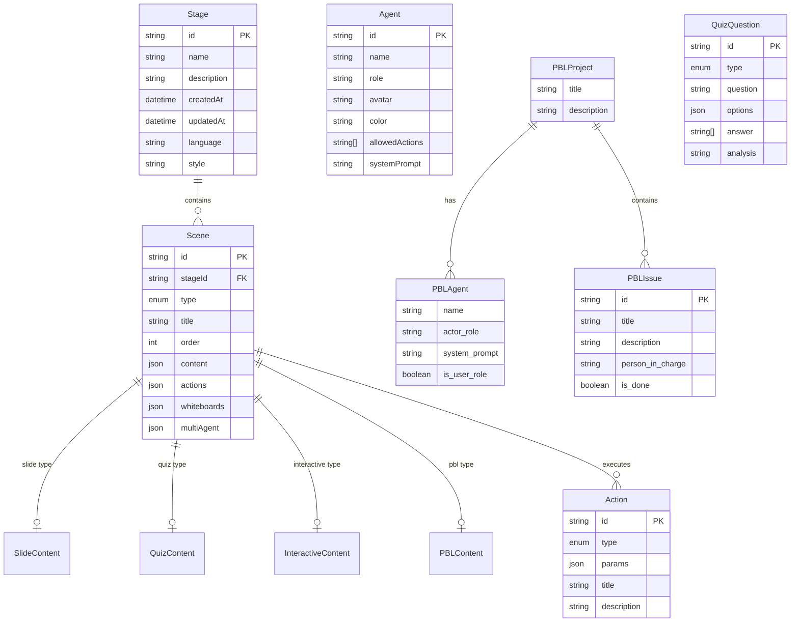
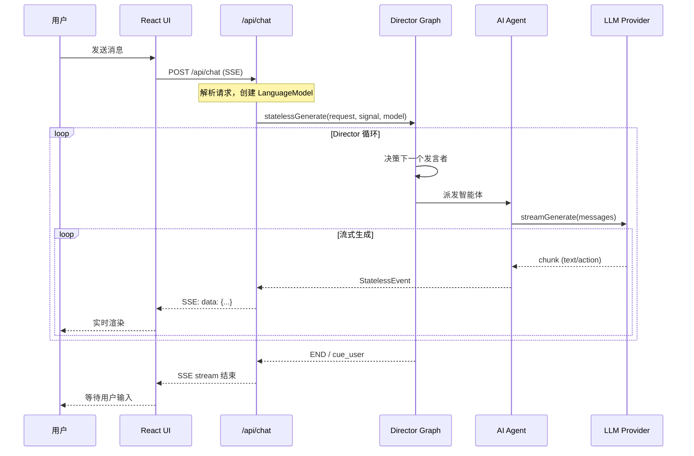

# OpenMAIC 数据流分析报告

**仓库:** THU-MAIC/OpenMAIC
**分析日期:** 2026-03-20
**分析者:** Claude AI Agent
**主要数据关注点:** API 数据流、状态管理、SSE 流式、IndexedDB 持久化

---

## 数据模型分析

### 核心数据实体



### 实体来源与关系

| 实体 | 来源文件 | 关系 |
|------|----------|------|
| Stage | `lib/types/stage.ts` | 顶层容器 |
| Scene | `lib/types/stage.ts` | 属于 Stage |
| Action | `lib/types/action.ts` | 属于 Scene |
| Agent | `lib/orchestration/registry/types.ts` | 全局注册 |
| PBLProject | `lib/pbl/types.ts` | 独立项目 |
| QuizQuestion | `lib/types/stage.ts` | 属于 QuizContent |

---

## 主要数据流追踪

### 流 1：请求/响应生命周期（课堂生成）

```
[用户输入] → [API 入口] → [验证层] → [生成管道] → [存储层] → [响应]
     │            │            │             │            │          │
     │            │            │             │            │          │
   表单数据    route.ts    Zod/手动校验   LLM 生成    IndexedDB   JSON
```

**详细流程：**

```
用户输入 (表单/PDF)
    │
    ▼
┌─────────────────────────────────────────────────────────────┐
│ POST /api/generate-classroom                                │
│ [app/api/generate-classroom/route.ts:45-70]                 │
│                                                             │
│ 1. 解析请求体                                                │
│ 2. 验证必需字段                                              │
│ 3. 解析 API Key 和模型                                       │
│ 4. 创建异步任务 (jobId)                                      │
└─────────────────────────────────────────────────────────────┘
    │
    ▼
┌─────────────────────────────────────────────────────────────┐
│ Generation Pipeline                                         │
│ [lib/generation/pipeline-runner.ts]                         │
│                                                             │
│ Stage 1: Outline Generation                                 │
│   └── UserRequirements → LLM → SceneOutline[]               │
│                                                             │
│ Stage 2: Scene Generation (并行)                            │
│   └── SceneOutline → LLM → SceneContent + Action[]          │
│                                                             │
│ Post-processing: TTS                                        │
│   └── SpeechAction.text → TTS API → audioUrl                │
└─────────────────────────────────────────────────────────────┘
    │
    ▼
┌─────────────────────────────────────────────────────────────┐
│ Storage Layer                                               │
│ [lib/utils/stage-storage.ts]                                │
│                                                             │
│ saveStageData(stage) → IndexedDB                            │
│   └── Stage + Scenes + Actions 持久化                        │
└─────────────────────────────────────────────────────────────┘
    │
    ▼
响应: { jobId, status, stageId }
```

**数据格式转换：**

| 阶段 | 数据格式 | 文件 |
|------|----------|------|
| 输入 | `UserRequirements` | `lib/types/generation.ts` |
| 大纲 | `SceneOutline[]` | `lib/types/generation.ts` |
| 场景 | `Scene[]` | `lib/types/stage.ts` |
| 动作 | `Action[]` | `lib/types/action.ts` |
| 存储 | JSON → IndexedDB | `lib/utils/stage-storage.ts` |

---

### 流 2：SSE 流式对话



**SSE 事件类型：**

| 事件类型 | 数据结构 | 说明 |
|----------|----------|------|
| `thinking` | `{ stage, agentId? }` | AI 思考中 |
| `agent_start` | `{ messageId, agentId, agentName, ... }` | 智能体开始 |
| `text_delta` | `{ content, messageId }` | 文本增量 |
| `action` | `{ actionId, actionName, params, ... }` | 动作执行 |
| `agent_end` | `{ messageId, agentId }` | 智能体结束 |
| `cue_user` | `{ fromAgentId? }` | 提示用户发言 |
| `error` | `{ message }` | 错误信息 |

**代码证据：**

```typescript
// app/api/chat/route.ts:145-153
for await (const event of generator) {
  if (signal.aborted) break;
  const data = `data: ${JSON.stringify(event)}\n\n`;
  await writer.write(encoder.encode(data));
}
```

---

### 流 3：播放引擎数据流

```
┌─────────────────────────────────────────────────────────────┐
│ PlaybackEngine                                             │
│ [lib/playback/engine.ts]                                   │
│                                                             │
│ 状态机: idle → playing ↔ paused → live → idle              │
└─────────────────────────────────────────────────────────────┘
        │
        │ processNext()
        ▼
┌─────────────────────────────────────────────────────────────┐
│ Action 消费                                                 │
│                                                             │
│ while (sceneIndex < scenes.length) {                        │
│   action = getCurrentAction()                               │
│   switch (action.type) {                                    │
│     case 'speech': → executeSpeech()                        │
│     case 'wb_*': → executeWb*()                             │
│     case 'spotlight': → executeSpotlight()                  │
│     case 'discussion': → confirmDiscussion()                │
│   }                                                         │
│ }                                                           │
└─────────────────────────────────────────────────────────────┘
        │
        ▼
┌─────────────────────────────────────────────────────────────┐
│ ActionEngine.execute(action)                               │
│ [lib/action/engine.ts]                                      │
│                                                             │
│ - 更新 Canvas Store (spotlight, laser)                     │
│ - 调用 AudioPlayer (speech)                                │
│ - 调用 StageAPI (whiteboard actions)                       │
└─────────────────────────────────────────────────────────────┘
        │
        ▼
┌─────────────────────────────────────────────────────────────┐
│ UI 更新                                                     │
│                                                             │
│ - Canvas 渲染更新                                           │
│ - 白板动画                                                   │
│ - 字幕显示                                                   │
│ - 进度更新                                                   │
└─────────────────────────────────────────────────────────────┘
```

---

## 状态管理分析

### Zustand Stores

| Store | 文件 | 职责 | 状态类型 |
|-------|------|------|----------|
| `useCanvasStore` | `lib/store/canvas.ts` | 画布、白板、特效 | 全局 |
| `useStageStore` | `lib/store/stage.ts` | 舞台、场景列表 | 全局 |
| `useSettingsStore` | `lib/store/settings.ts` | 用户设置、提供商 | 全局 |
| `useSnapshotStore` | `lib/store/snapshot.ts` | 播放快照 | 全局 |
| `useKeyboardStore` | `lib/store/keyboard.ts` | 键盘状态 | 全局 |
| `useMediaGenerationStore` | `lib/store/media-generation.ts` | 媒体任务 | 全局 |
| `useAgentRegistry` | `lib/orchestration/registry/store.ts` | 智能体注册 | 全局 |

### 本地 vs 全局状态边界

```
┌─────────────────────────────────────────────────────────────┐
│                      全局状态 (Zustand)                      │
│  ┌─────────────┐  ┌─────────────┐  ┌─────────────┐        │
│  │  Canvas     │  │   Stage     │  │  Settings   │        │
│  │  Store      │  │   Store     │  │  Store      │        │
│  └─────────────┘  └─────────────┘  └─────────────┘        │
│         │                │                │                │
│         └────────────────┼────────────────┘                │
│                          │                                  │
│                          ▼                                  │
│              ┌─────────────────────┐                       │
│              │   IndexedDB 持久化  │                       │
│              └─────────────────────┘                       │
└─────────────────────────────────────────────────────────────┘

┌─────────────────────────────────────────────────────────────┐
│                      本地状态 (useState)                     │
│  ┌─────────────┐  ┌─────────────┐  ┌─────────────┐        │
│  │  表单输入   │  │  UI 交互    │  │  临时数据   │        │
│  └─────────────┘  └─────────────┘  └─────────────┘        │
└─────────────────────────────────────────────────────────────┘
```

### 状态变更模式

**Immer 模式 (不可变更新):**

```typescript
// Zustand + Immer 模式
import { immer } from 'zustand/middleware/immer';

const useStore = create(
  immer((set) => ({
    data: {},
    update: (id, value) =>
      set((state) => {
        state.data[id] = value; // Immer 允许"直接"修改
      }),
  }))
);
```

### 副作用处理

| 副作用类型 | 处理方式 | 示例 |
|------------|----------|------|
| API 调用 | 自定义 Hooks | `use-scene-generator.ts` |
| 订阅 | useEffect + 清理 | `use-audio-recorder.ts` |
| 持久化 | Zustand middleware | `stage-storage.ts` |

---

## 持久化层

### 存储技术

| 存储类型 | 技术 | 用途 | ORM/ODM |
|----------|------|------|---------|
| 主存储 | IndexedDB | 课程数据持久化 | Dexie |
| 会话存储 | 内存 | SSE 状态 | 无 |
| 配置存储 | localStorage | 用户设置 | 无 |
| 缓存 | IndexedDB | 媒体文件 | Dexie |

### IndexedDB Schema

```typescript
// lib/utils/stage-storage.ts
const db = new Dexie('OpenMAICDB');

db.version(1).stores({
  stages: 'id, name, createdAt, updatedAt',
  slides: 'id, stageId',
  media: 'id, type, blob',
});
```

### 数据持久化流程

```
┌─────────────────────────────────────────────────────────────┐
│                     持久化流程                              │
│                                                             │
│  Zustand Store                                              │
│       │                                                     │
│       │ 变更                                                │
│       ▼                                                     │
│  ┌─────────────┐                                           │
│  │  useEffect  │ ← 监听 store 变化                         │
│  │  自动保存   │                                           │
│  └─────────────┘                                           │
│       │                                                     │
│       ▼                                                     │
│  ┌─────────────┐                                           │
│  │   Dexie     │ → IndexedDB                               │
│  │   ORM       │                                           │
│  └─────────────┘                                           │
│       │                                                     │
│       ▼                                                     │
│  浏览器本地存储                                             │
└─────────────────────────────────────────────────────────────┘
```

---

## 数据安全与隐私

### 敏感数据处理位置

| 数据类型 | 处理位置 | 安全措施 |
|----------|----------|----------|
| API Key | 服务端环境变量 | 不暴露到客户端 |
| 用户输入 | API 层 | 输入验证 |
| 生成内容 | IndexedDB | 本地存储 |

### 加密状态

| 维度 | 状态 | 证据 |
|------|------|------|
| 传输加密 | ✅ HTTPS | Vercel/部署配置 |
| 静态加密 | ⚠️ 无 | IndexedDB 明文 |
| API Key 存储 | ✅ 安全 | 环境变量 / localStorage (用户选择) |

### PII 处理模式

```typescript
// 无用户账户系统，PII 有限
// 用户配置存储在 localStorage
interface UserProfile {
  nickname?: string;
  bio?: string;
  avatar?: string;
}
```

### 输入净化

```typescript
// app/api/chat/route.ts:69-74
if (clientBaseUrl && process.env.NODE_ENV === 'production') {
  const ssrfError = validateUrlForSSRF(clientBaseUrl);
  if (ssrfError) {
    return apiError('INVALID_URL', 403, ssrfError);
  }
}
```

**SSRF 防护:** `lib/server/ssrf-guard.ts`

---

## 数据流总结

### 关键数据流路径

1. **生成流**: 用户输入 → LLM → JSON → IndexedDB
2. **对话流**: 用户消息 → SSE → LLM Stream → UI 更新
3. **播放流**: IndexedDB → Actions → 执行引擎 → UI 渲染
4. **导出流**: IndexedDB → 转换 → PPTX/HTML 文件

### 数据格式演进

```
UserRequirements (用户输入)
       │
       ▼
SceneOutline[] (大纲 JSON)
       │
       ▼
Scene[] (完整场景)
       │
       ├── SlideContent (幻灯片)
       ├── QuizContent (测验)
       ├── InteractiveContent (互动)
       └── PBLContent (PBL)
       │
       ▼
Action[] (动作序列)
       │
       ├── SpeechAction → TTS → audioUrl
       ├── WbDrawTextAction → 白板渲染
       └── SpotlightAction → Canvas 特效
       │
       ▼
IndexedDB 持久化
```

---

*报告生成日期: 2026-03-20*
*所有文件引用均基于实际代码路径*
